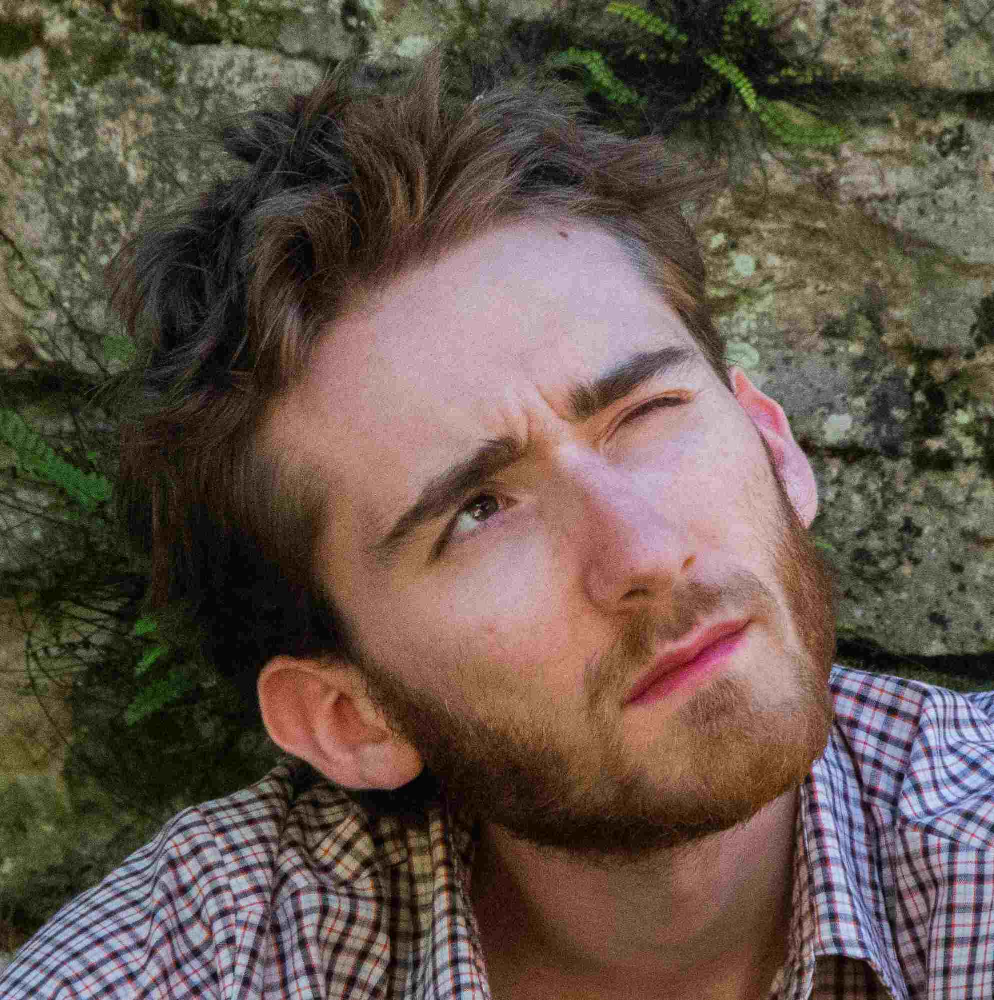

---
# Feel free to add content and custom Front Matter to this file.
# To modify the layout, see https://jekyllrb.com/docs/themes/#overriding-theme-defaults

layout: home
# title: About
---

## About me 

Hi! I am Maël Madon, researcher in Computer Science in the [SEPIA team](https://www.irit.fr/departement/architecture-systemes-reseaux/equipe-sepia/) at IRIT, University of Toulouse.

I defended my PhD in April 2024 about digital sufficiency in large-scale distributed systems.
My PhD supervisors were [Georges Da Costa](https://www.irit.fr/~Georges.Da-Costa/) and [Jean-Marc Pierson](https://www.irit.fr/~Jean-Marc.Pierson/).
I want to go beyond energy efficiency techniques and involve the end-user of data centers to help mitigate the environmental footprint of ICT.

## Research interests

- Green IT / ICT for Sustainability
- Digital Sufficiency
- Modelling and simulation of distributed systems
- Energy- and user-aware scheduling

## Education
- **PhD in Computer Science, 2024.** 
*Université de Toulouse (France)*
- **Diploma of École Polytechnique, 2021.**
*École Polytechnique, Palaiseau (France)*
- **Master of Science in Engineering, 2021.**
*KTH Royal Institute of Technology, Stockholm (Sweden)*

## Other

Apart from research, my passions are climbing, singing and playing the guitar.
I try to live sustainably because I am convinced that life can be enjoyed without overshooting the natural limits of our planet! 